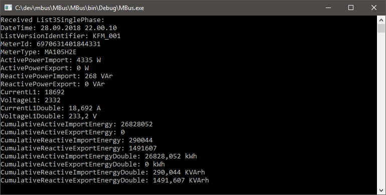
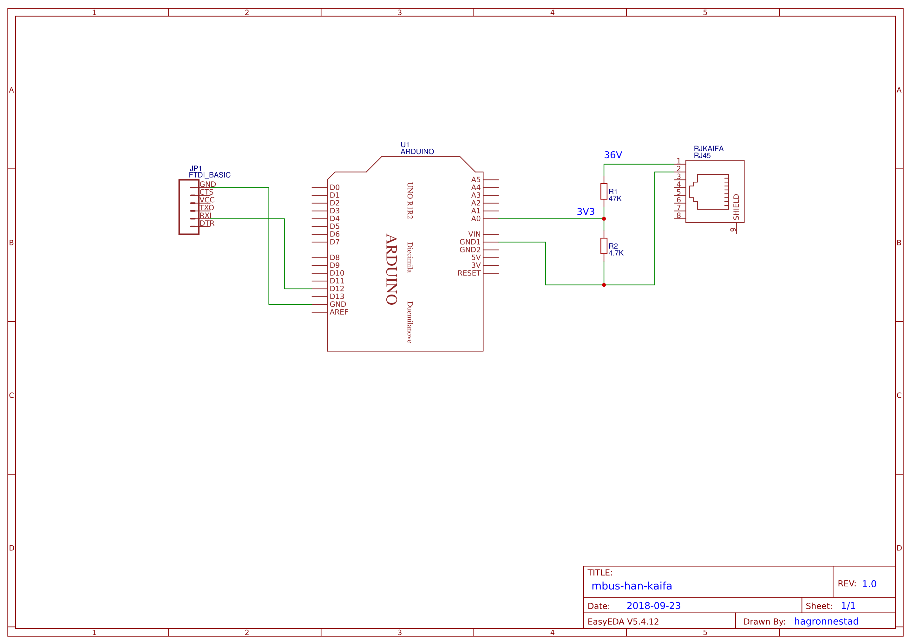

# mbus-han-kaifa
DIY electronics and code to read data from my KAIFA MA105H2E electricity meter.

## Code
This library aims to read and decode all packet types from the Norwegian M-Bus smart electricity meters. The screenshot below shows a test application outputting data from the various packet types. Not all packet types have been implemented yet.




## Electronics
### Simple Circuit Diagram - Arduino Analog Input -> TTL

This circuit uses a simple voltage divider and an Arduino to convert the resulting 2.2V-3.3V signal to a 5V TTL signal.




### Arduino Sketch

[Electronics/Arduino/A0_to_TTL/A0_to_TTL.ino](Electronics/Arduino/A0_to_TTL/A0_to_TTL.ino)

Threshold value needs to be tuned based on the voltage divider. Write `val` to serial to find the min and max value and choose a fitting threshold.

```arduino
void setup()
{
  pinMode(12, OUTPUT);
}

int val = 0;

void loop()
{
  val = analogRead(0);
  digitalWrite(12, val > 400);
}
```
